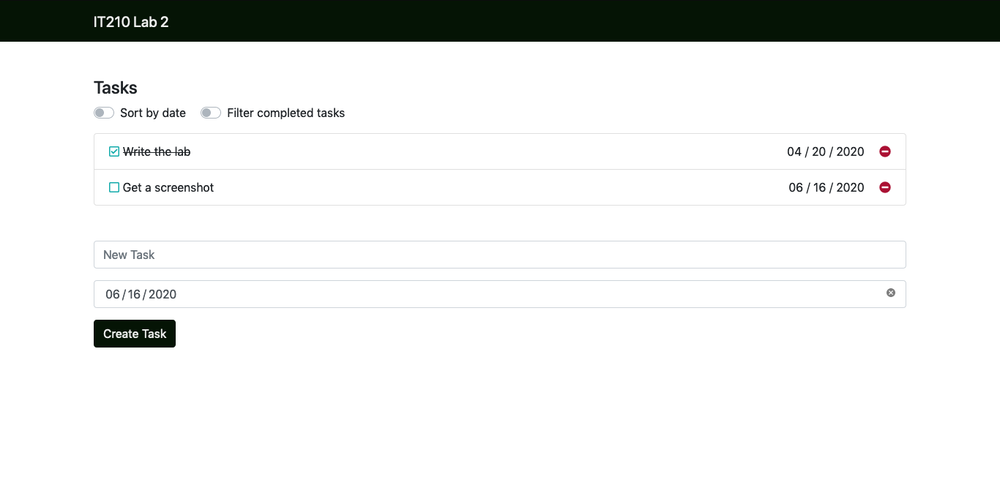

# Lab 2A - JavaScript Part 1

### Overview

JavaScript (not to be confused with [Java](https://i.imgur.com/lL3LtFD.png)) is a programming language that every browser knows how to interpret, and can be included in HTML documents to help make websites more dynamic. One major piece of JavaScript that you will become familiar with is the **DOM**, or **D**ocument **O**bject **M**odel. The DOM, as it describes itself, is a JavaScript _object_ that includes everything in your HTML _document_. [CSS Tricks made a really good, _short_ article about it that you should read.](https://css-tricks.com/dom/) In our analogy of the body, HTML is the skeleton, CSS is the skin, and JavaScript functions as the muscles that move the pieces all around and give the app function.

### Functionality

- Write JavaScript for each of the CRUD operations
- Use local storage to store persistent data in the browser
- Manipulate the DOM with JavaScript

### Concepts

- Document Object Model
- Object-Oriented Programming
- Browser Storage types
- UML

### Technologies

- JavaScript
- JSON
- Browser Development Tools

### UML Diagrams

A brief explanation of UML diagrams before you start the project.

This lab is where you will create your first UML diagrams in this class. UML diagrams (Unified Modeling Language diagrams) are used to model applications to easily represent different functionalities of the application. UML diagrams are typically created before the actual project because UML diagrams are meant to assist the developers in mapping out and creating the project. 

The UML diagrams that you'll create for this lab are meant to model the functionality of saving data to and reading data from local storage using CRUD functions. There are many different types of UML diagrams and for this lab, you will create an Activity Diagram. Here is a link to some helpful documentation on activity diagrams (this can also be found in the schedule on Learning Suite): [Activity Diagram Documentation](https://www.lucidchart.com/pages/uml-activity-diagram)

## Step 1: Add muscles to your skeleton

As we mentioned before, JavaScript should be added as the last tag inside the `<body>` tag of your document. You will need to add your custom script file there.

1. Create a new file in the `js` folder called `script.js`

2. Add a `<script></script>` tag to the bottom of your HTML file, linking your script file to your document:

    ```html
    <!DOCTYPE html>
    <html>
        <!-- head -->
        <body>
            <!-- body, etc -->
            <script src="js/script.js"></script>
        </body>
    </html>
    ```

First things first: we will need data. In JavaScript, it's as easy as creating a new variable:

```JavaScript
let tasks = []
```

> Note: You will notice that I didn't put a semi-colon at the end of the line. JavaScript rarely actually needs a semi-colon, so I choose not to worry about it. It's purely a stylistic choice, so do whatever helps you sleep at night. VSCode has what's called a "Linter" built-in, which is a program that automatically fixes your code to be more readable. You can modify the default code style by changing the JavaScript settings in VSCode's preferences.

3. Let's make a JavaScript class to represent our tasks at the beginning of our `script.js`:

    ```JavaScript
    class Task {
        constructor({ text, date, done, id }) {
            // HINT This method is the constructor. In C++, this would be
            // the Task() method. The curly braces inside the constructor is // a JavaScript syntax that is called 'deconstruction'. This
            // means the constructor will ask for an object
            // (`{i: 'am', an: 'object'}`) with the parameters `text`,
            // `date`, `done`, and `id`. This will make it easier to
            // convert it from the local storage database we will set up.
            this.text = text
            this.date = date
            this.done = done
            this.id = id
        }
        toHTML() {
            // TODO: Fill out this method. It should return a string version
            // of this task, including an `<li>` tag and all of the
            // css classes you used to make it look pretty. It should
            // display the `text`, `date`, and `done` property of this
            // Task. It should also have two inline event handlers, which call the
            // update and delete function, with this Task's `id` as a
            // parameter.
            return `
            <li>
            <!-- Fill me out -->
            </li>
            `
        }
        prettyDate() {
            // TODO: Fill out this method. It should return the date in our
            // locale's format, 'MM / DD / YYYY', instead of the
            // easily-sortable international standard, 'YYYY-MM-DD'.
            return ``
        }
        toggle() {
            // TODO: Fill out this method. It should flip this Task's `done`
            // property from `true` to `false`, or from `false` to `true`.
        }
    }
    ```

    > Let's take a second and compare this to C++.
    > 
    > First, we should note that this class is going in the same file it will be used in. Unlike C++, where a class is typically declared in a `.h` file and defined in a `.cpp` file, then `#include`d, in JavaScript, the more files we reference, the more HTTP requests we need to make, and generally, the slower our site becomes to load.
    > 
    > Next, let's take a look at how we might write a C++ class:
    > 
    > ```c++
    > class Task {
    >     public:
    >         // methods
    >         Task(string, string, bool, int);
    >         string toHTML();
    >         string prettyDate();
    >         void toggle();
    >         // members
    >         string text;
    >         string date;
    >         bool done;
    >         int id;
    > }
    > ```
    > 
    > Everything that is part of our JavaScript Task class would be considered public. That is, anyone with access to a task has access to change its `text`, `date`, `done`, and `id` properties.
    > 
    > In JavaScript, there are no declared types. At runtime, objects are checked to see if they can be used in the situations we put them in.
    > 
    > The constructor is defined differently, `Task::Task` vs `Task.constructor`, and we also have the fancy [object deconstruction](https://wesbos.com/destructuring-objects), which is not possible in C++.
    >
    > When initializing a new Task, in both languages we will use the `new` keyword.

4. Now we will want to add a task to our list.
    
    We can add a JavaScript instance of a class (Note the use of the `new` keyword, and the parameter is an Object, denoted by curly braces: `{}`) to the array when we create the array by typing it inside the square brackets:

    ```JavaScript
    let tasks = [
        new Task({
            text: "First task",
            done: false,
            date: "2020-02-10",
            id: Date.now() // makes a unique id
        })
    ]
    ```

    Great! We now have an extremely rudimentary database! However, this database isn't permanent, and every time we refresh the page, it will erase everything and start over. What we've done is defined our **Global State**.

    **Global State** is a buzzword you'll hear which refers to the copy of the data that you have in memory. Memory is temporary and is deleted when the program terminates.

    To make our tasks more permanent, we will be using a couple of tools:

    | Tool | Description |
    | ---- | ----------- |
    | JSON | **J**ava**S**cript **O**bject **N**otation is basically a very common way of storing JavaScript Objects in a String or in a `.json` file. It is widely used, not just in JavaScript, but in almost every language for sending and storing data. |
    | Local storage | Every browser has local storage, which is a small database that stores key-value pairs right on your local computer. Common uses are to store local settings like whether you want your app to be shown in dark mode, and have those settings remain saved even when you close the browser. |

    If you haven't figured it out by now, we will turn our `tasks` array into a string using JSON, and then store it in our local storage database so that the data will persist until you delete it!

    To get this done, we will need a function to save everything into the `localStorage` of the browser. I'll call it `updateStorage`, and it will take a JavaScript object, turn it into a JSON string, and store it in `localStorage`.

5. Add a function to your `script.js` file which accepts data as a JavaScript array, and sets it in your `localStorage`:

    ```JavaScript
    function updateStorage(newData) {
        // ... update the local storage
    }
    ```

    Use `localStorage.setItem('database', jsonString)` to set our JSON within the `updateStorage` function. It takes a string, so you'll have to convert the `newData` object to a string with `JSON.stringify(newData)`.

6. Add a function to your `script.js` file which reads data from `localStorage`, and returns it as a JavaScript array:

    ```JavaScript
    function readStorage() {
        // ... read from the local storage
    }
    ```

    Use `localStorage.getItem('database')` to retrieve our JSON within the `readStorage` function. It returns a string, so you'll have to convert it to an object with `JSON.parse(jsonString)`.

    It's possible that the `JSON.parse(jsonString)` will throw an error because we haven't set the database, or it has been cleared by the user. This error won't be very useful as a task list, so you can use the logical OR operator (`||`) to set a default value to return. Do this inside your `readStorage` function, similar to this:

    ```JavaScript
    let result = JSON.parse(jsonString) || []
    ```

    > We do this because JavaScript is what's called a "truthy" language, which means that every expression can be converted to a boolean: `true` or `false`. The above works because if any part of the first expression fails, the expression is "falsy" (can be converted to `false`), and therefore `result` will be set to whatever comes after the `||` (OR) operator (in this case, an empty array `[]`). If it succeeds, the expression is "truthy" (can be converted to `true`), and JavaScript will not even notice what we put after the `||`, because the first one is already true. [Read more on MDN](https://developer.mozilla.org/en-US/docs/Web/JavaScript/Reference/Operators/Logical_Operators#Description)

    > Note: When you use `JSON.parse(jsonString)`, it returns JavaScript Objects, which don't have any of those fabulous methods we wrote. Luckily, We can loop through our `tasks` using `.map()`, and convert each `task` to a Task instance:

    ```JavaScript
    result = result.map(taskData => new Task(taskData))
    ```

    > This is called a [Higher-Order Function](https://www.ibrahima-ndaw.com/blog/15-must-known-javascript-array-methods-in-2020/). These are powerful, beautiful, useful methods built into JavaScript for easy manipulation of arrays, including `.map()`, which takes a function, calls the function on every item in the array, and returns a list of those results. In our example, the `taskData => new Task(taskData)` is equivalent to `function (taskData) { return new Task(taskData) }`, and all together returns a list where every bit of task data is converted into a new Task object.

7. Call this `readStorage` function inside the body tag of the index.html page using the onload event listener, to read in any previously-saved data. Do this instead of hardcoding the contents of `tasks` like we were before.

Great! We now have a way to read and write to a permanent (until you clear your cache) database! Next, we will want to set up our basic CRUD operations described in the last lab.

## Step 2: CRUD

1. Create 4 functions in your `script.js` file:

    ```JavaScript
    function createTask() {
        // TODO: Pull in form data from DOM
        // TODO: Format it to JSON
        // TODO: Save it to local storage
        // Hint - Look at the JavaScript code from lab 1B to see how to extract form data
    }
    function readTasks() {
        // TODO: Pull in tasks from local storage
        // TODO: Parse tasks using the toHTML() function
        // TODO: Update DOM accordingly
    }
    function updateTask(id) {
        // TODO: Update the task in `tasks` array by flipping it's `done` value
        // TODO: Save to local storage
        // TODO: Make the DOM update
    }
    function deleteTask(id) {
        // TODO: Delete task from `tasks` array
        // TODO: Save to local storage
        // TODO: Make the DOM update
    }
    ```

2. Finish implementing the functionality described in the comments

## Step 3: Hook Everything Up

This task list should be functional by the end of this lab. When you click to create a task, the text input should appear in the task list. When you click the checkmark of a task, it should toggle between done and not done. When you click the delete button, it should be removed from the page and the database. Every task should remain (check or unchecked as it was) when you refresh the page, and most importantly, there should be no bugs.

# Tips

## `console.log()`!

The most important debugging tool we have as front-end developers is the inspector. One of the tabs in the inspector is the console. JavaScript has a built-in object called `console` which has a few methods, most importantly `.log()`. Whenever a `console.log()` statement is run, it logs whatever arguments you provide to the console.

## Saving the Date

Dates and times are [tricky](https://xkcd.com/1883/). As far as the modern-day browser goes, an HTML `<input type="date">` will ask the user for a date in their [locale-specific way](https://en.wikipedia.org/wiki/Date_format_by_country) (for us, that's `'MM / DD / YYYY'`), and there's no way to fix that with vanilla JavaScript. It then saves it in the universal format, `'YYYY-MM-DD'`. You need to display it in the same format the user selected, or they might get confused, or angry, or something. When we sort these in the future, it will be a lot easier to keep them in the `'YYYY-MM-DD'` format to sort them (we need the year 2019 before the year 2020).

You should make a function that converts the `'YYYY-MM-DD'` format to `'MM / DD / YYYY'`. Have this function called every time you convert a task to an HTML list item. One option is to look into regex to help you do this.

## Parameters for Update and Delete Event Handlers

Unlike the create and read functions you will need to pass in parameters into the update and delete functions. You will need to pass in the ID of the certain task in your tasks list that is going to be updated or deleted. This is important to know because your update and delete functions won't work properly if they do not have the correct parameters passed to them.

## `onkeyup` vs `oninput` vs `onchange`

The `oninput` listener is the current standard for listening for changes to inputs. However, it's a little newer, and not perfect in all browsers. The `onkeyup` listener is more widely supported, and behaves in mostly the same way, but only when a key is released. Open the provided `event_test.html` in the browser (if double-clicking doesn't work, open a new tab and hit <kbd>Ctrl-o</kbd>). Open the inspector console and see when the events are logged. Try pasting text, holding down a key, and clicking away to get a feel for the differences in your browser. Try other browsers out as well, if you can, to see any differences and similarities.

With some inputs, like the date picker, the mouse is the primary input. In these situations (in my browser), the `oninput` will trigger, as well as the `onchange`, but the `onkeyup` does not. On the number input, the same is true if you increment the number, but it will otherwise behave similarly to the text input.

## Using `event.preventDefault()`

In some languages, like JavaScript and PHP, when you submit a form it will reload the page by default. In HTML, if you have a button inside of a form tag, the form will be submitted and the page will reload every time that button is clicked. To prevent the page from reloading, we use event.preventDefault() in our JavaScript file. Below is a very simple example of how to use this method. 

JavaScript:
```
function prevent(event){
    /* Make sure it is the first line of code in the function, if there is an error in a line of code that is above event.preventDefault() the function will stop and never reach it.
    /* If you were to comment out the line below you would see that the page reloads every time you click the button */
    event.preventDefault();
}
```
HTML:
```
<form>
  <button onclick="prevent()">Button</button>
</form>
```

# Syntactical Sugar

## Template Strings

Template strings (also referred to as template literals) are created using \`backticks.\` Template strings allow you to insert values of variables with strings. To do this you will need to use the `${variable}` syntax. 
```JavaScript
let name = `Fred`
let greet = `Hello ${name}` 
console.log(greet) // This will print out "Hello Fred" in the console. 
```

## Ternary Operator

Sometimes when you'll need to add a conditional statement it's not always convenient or practical (sometimes not very possible) to use if and else statements. There is a different conditional statement that can be used instead called a [ternary operator](https://developer.mozilla.org/en-US/docs/Web/JavaScript/Reference/Operators/Conditional_Operator). This operator is useful when you need to add conditional statements inside of a JavaScript template string. Just as an example, this operator will be helpful when changing the state of the checkbox buttons in your tasklist from true to false (checked to unchecked). 

## Toggling Booleans

You most likely know what a boolean variable is, but just to refresh our memories, a boolean is a variable that has either a true or false value. Toggling a boolean is when you toggle back and forth between the true and false values. Doing this is pretty simple. All you need to do is assign the boolean to its opposite value.

```JavaScript
myBool = !myBool; // Changes the value of the boolean to true if it is false and vice versa. 
```

# Example



# Report/Pass off

- [ ] Site works on live server
- [ ] User is able to Create, Read, Update, and Delete tasks.
- [ ] Site is backed up in the correct git repository received from Git Classrooms
- [ ] UML Diagram
- [ ] Demonstrate the workflow for making a change on the live server using Git
- [ ] JavaScript is in an external file, separate from your HTML
- [ ] Text indicates that the task is completed (e.g., crossed out or dimmed).
- [ ] Tasks are implemented as instances of a Task class, and casted in the `readStorage` function.
- [ ] Local storage has tasks in it
- [ ] Tasks on the page match tasks in the database
- [ ] Each task has a name and due date displayed
- [ ] Dates are displayed in MM/DD/YYYY format
- [ ] Site uses JavaScript Template Strings to set HTML from database
- [ ] DRY Principle compliant

## UML Diagram
- [ ] UML Diagram in digital form, showing the functionality of updating and saving tasks to local storage using CRUD functions.
- [ ] UML Diagram in digital form, showing the functionality of reading tasks from local storage
> Note: These could be separate UMLs or one single one depending on how you want to organize them just make sure all functionality is covered.
# Writeup Questions

- What are two differences and similarities between JavaScript and C++? (Think of differences and similarities that are more unique to these 2 languages not all languages in general)
- What is the difference between JSON and JavaScript objects?
- If you open your web page in two different browsers, will changes on one appear on the other? Why or why not?
- How long did you spend on this lab?
